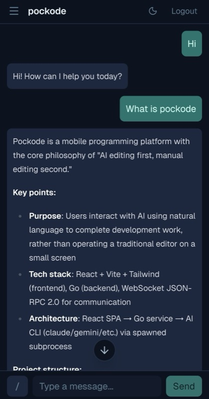
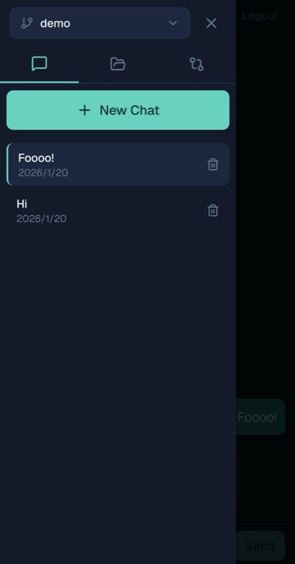
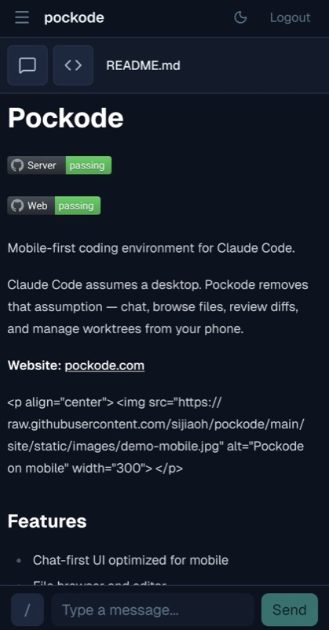
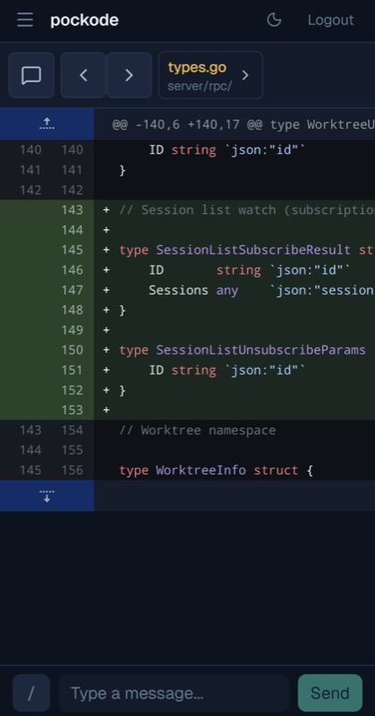

# Pockode

[](https://github.com/sijiaoh/pockode/actions/workflows/server.yml)
[](https://github.com/sijiaoh/pockode/actions/workflows/web.yml)

**Your dev machine in your pocket.**

Pockode connects your phone to your home dev machine running Claude Code. Chat with AI, browse files, review diffs, and manage worktrees — from anywhere.

| Chat | Sessions | File | Diff |
|:----:|:--------:|:----:|:----:|
|  |  |  |  |

## Why Pockode?

Your powerful dev machine sits at home. With Pockode, you can use it from anywhere.

- **Commute coding** — Fix bugs on the train using your home workstation
- **Quick hotfixes** — Push a fix from your couch, no laptop needed
- **Code review** — Review diffs while waiting in line
- **Stay in flow** — Your ideas don't wait for you to get home

## Features

| Feature | Description |
|---------|-------------|
| **AI Chat** | Natural language coding with Claude Code |
| **File Browser** | Navigate and edit your codebase |
| **Diff Viewer** | Review changes with syntax highlighting |
| **Session Management** | Switch between projects and conversations |
| **Worktree Support** | Manage multiple branches simultaneously |

## Quick Start

```bash
# Install
curl -fsSL https://pockode.com/install.sh | sh

# Run (on your dev machine)
pockode -auth-token YOUR_PASSWORD
```

Open http://localhost:9870 in your browser. Done.

## Status

Early-stage. Actively developed. APIs may change.

## Feedback

Ideas? Bugs? [Open an issue](https://github.com/sijiaoh/pockode/issues).

> Not accepting code contributions yet (heavy refactoring in progress), but feedback shapes the roadmap.

## Links

- **Website:** [pockode.com](https://pockode.com)
- **Issues:** [GitHub Issues](https://github.com/sijiaoh/pockode/issues)

## License

[O'Saasy License](LICENSE.md) — Free for personal use.
